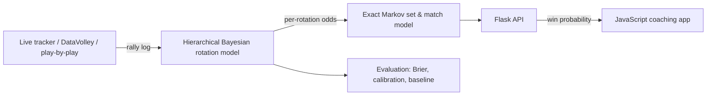

# PointIQ

**Predictive volleyball analytics.** PointIQ learns each rotation's side-out and point-scoring odds from rally-by-rally data, turns them into live set and match win probabilities with an exact Markov chain, and serves them to a JavaScript coaching app through a Python Flask API.

It answers the questions a coaching staff argues about before every match: which rotation to start in, whether the libero should serve, which rotation to fix in practice, and how likely the team is to win, set by set and rally by rally.

## Highlights

- **Bayesian estimation for small samples.** A hierarchical logistic model (statsmodels, variational Bayes) partially pools the six rotations and absorbs opponent strength with a per-match random effect, so rotations with few rallies don't produce wild estimates.
- **Exact Markov chain.** Every set state (score, both rotations, server) is solved exactly: backward induction below deuce, and a 216-state linear system for deuce. Best-of-3 and best-of-5 matches are handled too. A vectorized Monte Carlo simulation (20,000 sets per state) cross-checks it.
- **Rigorous evaluation.** Grouped (by match) cross-validation, Brier score, log loss, calibration charts, and a match-level bootstrap 95% CI against a score-only baseline.
- **Live model serving.** A Flask API (`/api/fit`, `/api/predict`, `/api/evaluate`) updates opponent strength rally by rally during a match. The front end's live tracker logs every rally and shows the model's win probability.
- **Tested.** 15 pytest tests (Python model and API) plus 21 JavaScript engine tests.

## Results (simulated seasons)

60 simulated matches, 10,088 rally states, 5-fold cross-validation by match ([full report](model/reports/demo/REPORT.md)):

| Model | Brier ↓ | Skill vs score-only | Improvement, 95% CI |
|---|---|---|---|
| Rotation model + in-match update | 0.158 | +5.1% | +0.009 [+0.003, +0.014] |
| Rotation model (pre-match only) | 0.165 | +0.6% | +0.001 [−0.002, +0.004] |
| Score-only baseline | 0.166 | — | — |

**Pre-match rotation odds alone barely beat the score.** Updating opponent strength during the match is what produces a significant improvement. The model also recovers known rotation rates: true weak-rotation side-out 55.0%, estimated 54.6% (80% interval 52.5–56.7%).


## Tech stack

**Model:** Python, pandas, NumPy, SciPy, scikit-learn, statsmodels, Flask, matplotlib, pytest
**App:** JavaScript (ES modules), HTML/CSS, SVG charts; no build step



## Run it

```bash
# model service
cd model && python3 -m venv .venv && .venv/bin/pip install -r requirements.txt
.venv/bin/python -m pointiq_model demo      # simulate, fit, evaluate, write a report
.venv/bin/python -m pointiq_model serve     # API on http://127.0.0.1:5050
.venv/bin/python -m pytest -q tests

# app (from the repo root, in a second terminal)
python3 tools/serve.py 8080                 # open http://localhost:8080/index.html
```

JavaScript tests run at http://localhost:8080/tests/index.html, or with `npm test` on Node 18+.

## What's in the app

| Page | What it does | Plan |
|---|---|---|
| Match day | Match win probability, outcome distribution, weakest rotation, what each lineup decision is worth | Starter+ |
| Lineup Lab | Serving order, libero rules (including libero serving in one rotation), serving subs and back-row swaps, court view per rotation, sub budget, serving-order search | Coach+ / search: Program+ |
| Match sim | Best-of-3 / best-of-5, custom set targets, first serve, start-rotation heatmap, game-theory start mixing, practice priorities | Starter+ / heatmap: Coach+ / game theory: Program+ |
| Live tracker | Two-button rally entry; rotations, serve and sets tracked automatically; live set and match win probability; in-match learning; rotation alerts; saves to history | Coach+ |
| Roster | Season stat entry with shrunk model ratings | all |
| Import | DataVolley `.dvw` (Hudl VolleyMetrics, DataVolley, VolleyStation), SoloStats/Hudl/MaxPreps CSV with column mapping, rotation sheets, multi-season history | varies |
| Multi-season model | Bayesian hierarchical model: shrunk current-season rates, next-season projections, persistence, P(rotation is really weak) | Program+ |
| Model lab | Rotation odds learned from logged rallies by the Python service, out-of-sample Brier/calibration vs a score-only baseline, exact-vs-Monte-Carlo check, switch predictions to learned odds | Program+ |
| Recruiting board | Level-adjusted, sample-size-aware prospect ratings with 80% ranges; staff weights; compare; notes; status pipeline | Program + Recruiting |
| Plans | Tiers, monthly / season / annual pricing, feature matrix, demo plan switcher | — |

## The math

**Rally model (`src/engine/markov.js`).** State = (our score, their score, our rotation, their rotation, who serves). Each rally is won with a probability that combines our rotation's side-out or point-score rate with the opponent's current rotation via log5 against the league base rate. A set is solved exactly. The deuce region collapses to a score difference in {−1, 0, +1} and that recurrent block is solved by fixed-point iteration. Match probability is a recursion over sets with alternating first serve and a coin toss before the deciding set. It's verified against 20,000-set Monte Carlo.

**Player → rotation model (`src/engine/lineup.js`).**
- Side-out = opponent serve errors + Σ over pass quality of P(pass q | the passers actually on court) × side-out given q, adjusted by the attack efficiency and number of attackers available.
- Point-score = server's ace rate + in-play × win probability given blocking, back-row defense and transition attack.
- Libero replacement, libero serving, serving subs and back-row swaps change who is on court per rotation and phase.
- Every player rate is shrunk toward a position prior.

**Observed + what-if.** When the rates come from real data (observed or hierarchical), lineup edits are applied as the model's change on the log-odds scale relative to the baseline lineup the data was collected with.

**Hierarchical model (`src/engine/hier.js`).** For each phase: `logit p = μ + α_rotation + β_season + γ_season×rotation`, with variance components learned by Gibbs sampling and older seasons down-weighted. It outputs:
- current-season shrunk rates
- next-season projections including turnover uncertainty
- persistence τα²/(τα²+τγ²)
- P(rotation below team average)

**Recruiting (`src/engine/scouting.js`).** Beta and gamma-Poisson shrinkage for sample size, a competition-level shift to an 18-Open equivalent, and position-weighted z-scores rescaled to a 20–80 scale. Measurables are blended in, and the 80% range comes from posterior simulation.

## Predictive model (rally-learned)

The Live tracker logs every rally (rotation, server, score, outcome), and DataVolley imports add theirs. The Python service in `model/` fits per-rotation odds with a hierarchical Bayesian logistic model, feeds them to the exact set Markov chain, and evaluates out of sample with Brier score and calibration against a score-only baseline. On simulated seasons:
- pre-match rotation odds alone barely beat the score;
- the model that also updates tonight's opponent strength rally by rally wins clearly (+5% Brier skill).

Details and caveats: [model/README.md](model/README.md), report: [model/reports/demo/REPORT.md](model/reports/demo/REPORT.md).

## Limitations and next steps

- **Effect sizes in the player (what-if) model are informed priors, not yet fit to data.** Rotation odds can now be learned from rallies (Model lab), but the coefficients in `LEAGUE.beta` that translate player stats into rotation odds (for example, how much +0.100 hitting efficiency moves side-out) still need re-estimating from a program's own rallies.
- **The `.dvw` parser is tested against files written to the published DataVolley layout** (the same one the openvolley R/Python packages read), not yet against real VolleyMetrics exports. Validate on a handful of real files before a demo.
- Recruiting level shifts and reference distributions are starting guesses. A staff should tune them, and a program's own signed-player history can calibrate them.
- Data lives in the browser (localStorage) with JSON backup/restore. Multi-seat staff sharing needs the hosted backend described in `BUSINESS.md`.

## Layout

```
index.html, styles.css         app shell and design system
src/engine/                    pure math and parsing (no DOM), unit-tested
  stats.js markov.js lineup.js optimize.js hier.js importers.js scouting.js plans.js dvwsim.js
src/app/                       UI: store.js (state), ui.js (charts), main.js (router), views/*
tests/                         engine.test.js + browser runner + node runner
tools/serve.py                 no-cache dev server
model/                         Python model service: estimation, Markov set model, evaluation, Flask API, tests
```
