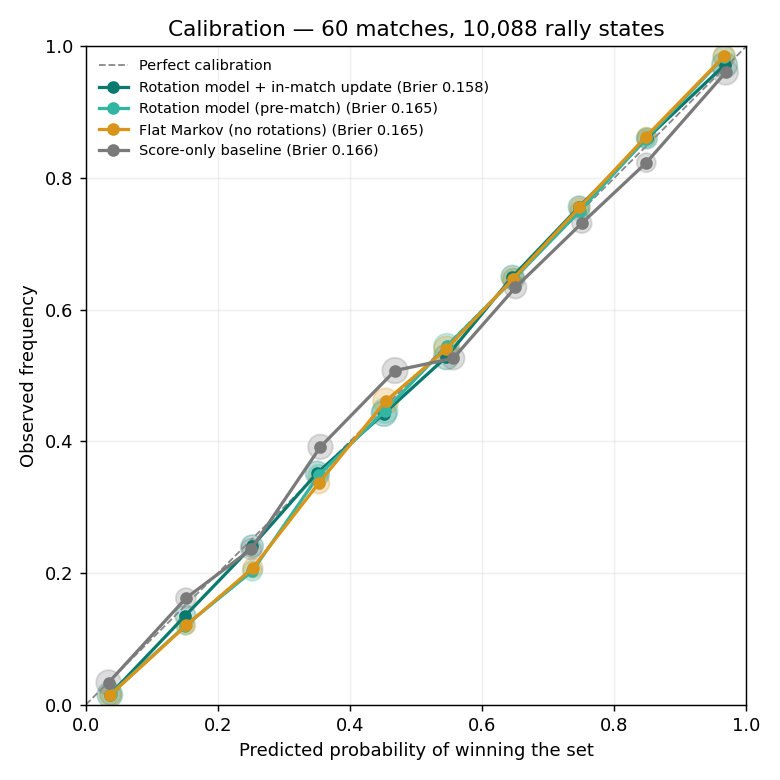

# PointIQ model report (simulated season)

60 matches · 233 sets · 10,088 rally states · 5-fold cross-validation by match

## Set win prediction (out of sample)

| Model | Brier ↓ | Log loss ↓ | Calibration error ↓ | Brier skill vs score-only | Improvement, 95% CI |
|---|---|---|---|---|---|
| Rotation model + in-match update | 0.1580 | 0.4685 | 0.0106 | +5.1% | +0.0086 [+0.0026, +0.0144] |
| Rotation model (pre-match) | 0.1654 | 0.4873 | 0.0130 | +0.6% | +0.0010 [-0.0020, +0.0042] |
| Flat Markov (no rotations) | 0.1650 | 0.4866 | 0.0153 | +0.8% | +0.0013 [-0.0017, +0.0047] |
| Score-only baseline | 0.1664 | 0.4902 | 0.0205 | +0.0% | — |

## Rotation rates (hierarchical, 80% intervals)

| Rotation | Side-out | Rallies | Point-score | Rallies |
|---|---|---|---|---|
| R1 | 62.9% (60.7%–65.0%) | 791 | 41.1% (39.0%–43.3%) | 856 |
| R2 | 61.4% (59.2%–63.5%) | 818 | 40.3% (38.2%–42.5%) | 834 |
| R3 | 61.0% (58.8%–63.1%) | 815 | 40.4% (38.3%–42.6%) | 841 |
| R4 | 54.6% (52.5%–56.7%) | 951 | 34.5% (32.3%–36.7%) | 758 |
| R5 | 61.0% (58.9%–63.2%) | 812 | 44.3% (42.1%–46.4%) | 901 |
| R6 | 59.5% (57.4%–61.6%) | 846 | 41.0% (38.9%–43.2%) | 865 |

## Exact Markov chain vs Monte Carlo

12 starting states, 20,000 simulated sets each. Largest gap: 1.51 standard errors (agreement expected within ~3).
